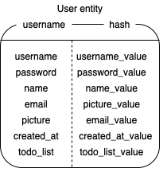
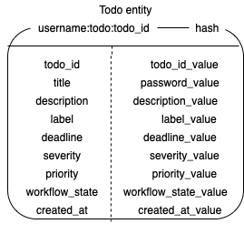
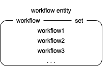

## Todo list app

### Brief description

​ This is a todo list app that have some features as follow:

- Allow user to register
- Allow user to login
- Allow user to logout
- Allow user get their profile
- Allow user to make their own workflow of todo list
- Allow user to get their todo list
- Allow user to get their detail todo
- Allow user to add new todo
- Allow user to remove todo from the list
- Allow user to update their todo
- Allow user to move their todo to the next workflow

For this application, proper authentication and authorisation is not implemented and the datastore was using redis. Because what i was trying to focus on is to get familiar with golang (go-chi router) as well as redis.

### API Contract

For more information: https://rajamoris.docs.apiary.io/#

### Redis schema

​ This app is formed from three major entiries and the data was done using redis. Below are the three major entities along with its brief description.

1. User entity



​ As shown above, the entity was done in redis hash, username will be the key and the subvalue consists of username, password, name, email, picture, login_status as well as the todo_list.

Table below will explain each of the field

| Field name | Field type        | Description                                                                                                                                                                                            | Value example                                                                                                                          |
| ---------- | ----------------- | ------------------------------------------------------------------------------------------------------------------------------------------------------------------------------------------------------ | :------------------------------------------------------------------------------------------------------------------------------------- |
| Username   | String (8 <= 256) | This field is the primary key for the entity. It holds unique value which can be used to distinguish users                                                                                             | Ex. Moris123, helloWorld.                                                                                                              |
| Password   | String (8 <= 256) | This field holds the user password which will be used when user login to the application                                                                                                               | Ex. secRetPassworD, iBetYouDontKnowMyPassword                                                                                          |
| Name       | String (1 <= 256) | This field holds the user name and this field is not unique.                                                                                                                                           | Ex. Moris, raja                                                                                                                        |
| Email      | String (1 <= 256) | This field holds the user email and this field must be unique so there won't be two users with the same email                                                                                          | Ex. moris@gmail.com, raja123@hotmail.com                                                                                               |
| Picture    | String url        | This field holds user picture.                                                                                                                                                                         | Ex. /Users/moris/Desktop/IceHouse/todo_list_exercise/user entity.png, /Users/moris/Desktop/IceHouse/todo_list_exercise/todo entity.png |
| Created_at | Time (RFC3339)    | This field used to specify when the user was created                                                                                                                                                   | Ex. 2021-11-01T13:41:04.603426+07:00                                                                                                   |
| Todo_list  | Radis hash        | This field holds the todo list of user. This todo list can have more than one todo inside the list. This field only stores the todo_id from the todo entity as the key and the todo title as the value | Ex. {101, learn golang, 102, swim, 103, learn redis}                                                                                   |

There are all the redis commands used for this entity:

- To Store user

```
HMSET [username] name '[name]' password '[password]' email '[email]' picture '[picture]' created_at '[created_at]'
```

- To get user

```
HGETALL [username]
```

2. Todo entity



​ As shown above, the entity was done in redis hash, todo_id will be the key and the subvalue consists of todo_id, title, description, label, deadline, severity, priority as well as the workflow_state.

Table below will explain each of the field

| Field name     | Field type            | Description                                                                                                    | Value example                                      |
| -------------- | --------------------- | -------------------------------------------------------------------------------------------------------------- | -------------------------------------------------- |
| Todo_id        | UUID                  | This field is the primary key for the entity. It holds unique value which can be used to distinguish the todos | Ex. uuid v4 string                                 |
| Title          | String (1 <= 256)     | This field holds todo title                                                                                    | Ex. Running, pick up laundry, finish todo list app |
| Description    | String (1 <= 256)     | This field holds todo description. This description is used to clarify the todo                                | Ex. Pick up pants and shirts laundry at xxx place  |
| Label          | String (1 <= 256)     | This fields is used to categorize the todo                                                                     | Ex. Study, Exercise,                               |
| Deadline       | Date (mm-dd-yyyy)     | This field shows when is the latest time the user can finish their todo                                        | Ex. 3-10-2021, 10-10-2021                          |
| Severity       | Enum                  | This field shows how severe the todo is. It helps the user to prioritize which todo they should do first       | Ex. Low, medium, high                              |
| Priority       | Enum                  | This field shows how important the todo is. It helps the user to prioritize which todo they should do first    | Ex. Low, medium, high                              |
| Workflow_state | String (1 <= 256)     | This fields is used to specifiy in which state the todo is in and it can be moved to another state             | Ex. Initiate, Ready, Finish                        |
| Created_at     | Time (RFC3339 format) | This field is used to specify when the todo was created                                                        | Ex. 2021-11-01T13:41:04.603426+07:00               |

There are all the redis commands used for this entity:

- To Store todo

```
HMSET [username]:todo:[todo_id] title '[title]' description '[description]' label '[label]' deadline '[deadline]' severity '[severity]' priority '[priority]' state '[state]' created_at '[created_at]'
```

- To get todo

```
HGET [username]:todo:[todo_id]
```

- To delete todo

```
DEL [username]:todo:[todo_id]
```

3. Workflow entity



​ As shown above, the entity was done in redis set, workflow be the key and the value could be added as much as the user wants. In my image above, three workflow values were specified.

Table below will explain each of the field

| Field name | Field type | Description                                                                            | Value example |
| ---------- | ---------- | -------------------------------------------------------------------------------------- | ------------- |
| Workflow   | String     | This field will be the key for the redis set.                                          | Ex. Workflow  |
| Workflow1  | String     | This field will be the value of the redis set key. It holds the state of the workflow. | Ex. Initiate  |
| Workflow2  | String     | This field will be the value of the redis set key. It holds the state of the workflow. | Ex. Running   |
| Workflow3  | String     | This field will be the value of the redis set key. It holds the state of the workflow. | Ex. Finish    |
| . . .      | String     | This field is used to show that it's possible to add more workflow to the redis set.   | Ex. Review    |

There are all the redis commands used for this entity:

- To store workflow

```
SADD [username]:workflow [workflow]
```

- To get workflow

```
SMEMBERS [username]:workflow
```
